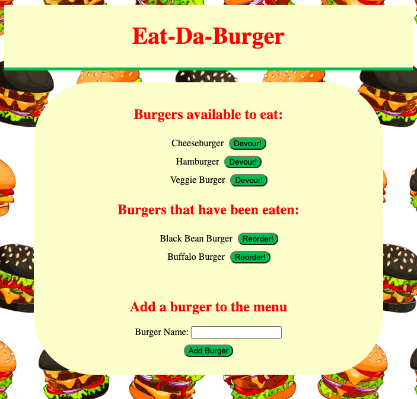

# eat-da-burger

  ## The Repository
  Link to repository: https://github.com/awebb8/eat-da-burger
  Link to deployed site: https://eat-da-burger-alix.herokuapp.com/

  ## About
  Eat-Da-Burger is a restaurant application that utilizes MySQL, Node, Express, Handlebars and ORM.  Eat-Da-Burger lets users input the names of burgers they'd like to eat. Each burger has a `Devour!` button that allows the burger to be eaten and then reordered. The app stores every burger in a database, whether devoured or not.

  

  ## Table of Contents
  * [Installation](#installation)
  * [Usage](#usage)
  * [Questions](#Questions)

  ## Installation
  If viewing through the application link, there is no need to install anything.  If you would like to clone the repository, then clone from the eat-da-burger repository on GitHub.  Once cloned, utilize "npm install" to install Express, Express-Handlebars, MySQL. Node and MySQL are used to query and route data in the app, and Handlebars is used to generate HTML.  For more information on installing and using Express, visit https://expressjs.com/en/starter/installing.html.  For more information on installing and using Express-Handlebars, visit https://www.npmjs.com/package/express-handlebars.  For more information on installing and using MySQL, visit https://www.npmjs.com/package/mysql.

  ## Usage
  View the application in a browser by clicking on the link above to the deployed site. Click on the "Devour!" button to devour a burger.  Click on the "Reorder!" button to reorder a burger and devour it again.  To add a new burger to the menu, type in the name of a burger into the "Burger Name" field, then click "Add Burger" for the burger to appear in the "Burgers available to eat" section.

  ## Questions
  Please direct all questions to [alixkwebb@gmail.com](alixkwebb@gmail.com)
  You may view and follow my GitHub profile by clicking the following link: https://github.com/awebb8
